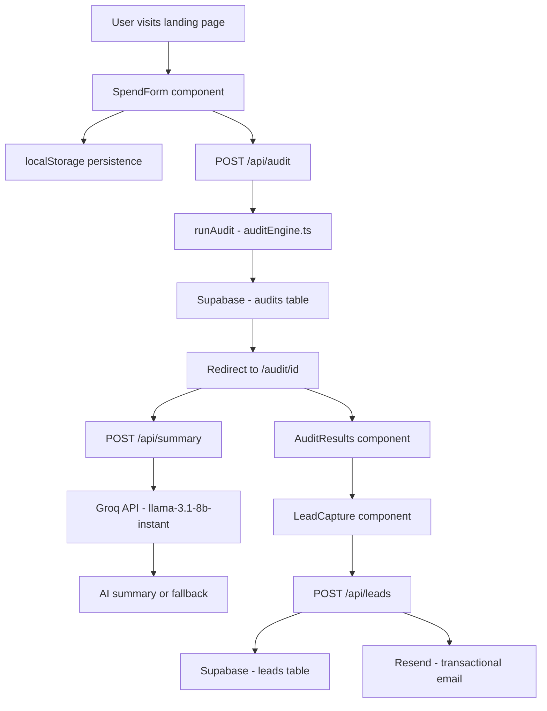

# Architecture

## System Diagram

## Data Flow

1. User fills the spend form and hits "Run Free Audit"
2. `SpendForm` sends `FormData` to `POST /api/audit`
3. API route calls `runAudit()` — pure TypeScript function, no external calls
4. Audit result is stored in Supabase `audits` table, returns UUID
5. User is redirected to `/audit/[id]`
6. Page fetches audit from Supabase by ID
7. Page calls `POST /api/summary` with audit data — Groq generates 100-word summary, falls back to template on failure
8. Results page renders with per-tool breakdown, hero savings, AI summary
9. User optionally submits email via `LeadCapture`
10. Email is stored in Supabase `leads` table, Resend sends confirmation email
11. Shareable URL (`/audit/[id]`) strips identifying info, shows tools and savings publicly

## Stack Justification

**Next.js 14 App Router** — chosen because API routes, SSR, and static generation are all in one framework. The audit result page needs SSR for OG meta tags to work correctly with link previews. Next.js handles this without a separate backend.

**TypeScript** — required for a financial tool. Type safety on the audit engine prevents silent math errors. The `Recommendation` and `AuditResult` types make the data shape explicit across the entire codebase.

**Supabase** — free tier covers this use case completely. Provides both a Postgres database and a REST API without running a separate server. Row-level security protects lead data.

**Groq** — free tier, fast inference, sufficient for 100-word summaries. Anthropic API was the first choice but requires paid credits. Groq's llama-3.1-8b-instant produces acceptable quality for this use case at zero cost during development.

**Resend** — simplest transactional email setup available. One API call, no SMTP configuration, free tier sufficient for this project.

**Tailwind + shadcn/ui** — Tailwind for utility-first styling, shadcn for accessible, unstyled primitives. Avoided pre-built admin templates as required by the assignment.

**Vercel** — zero-config deployment for Next.js. Automatic preview deployments on every push. Free tier sufficient.

## What I Would Change at 10,000 Audits Per Day

**1. Caching audit results** — Currently every page load fetches from Supabase. At scale, add Redis caching for audit results by ID. Cache TTL of 24 hours since audit data does not change after creation.

**2. Rate limiting** — Currently only honeypot protection on leads. At scale, add IP-based rate limiting on `/api/audit` using Upstash Redis to prevent abuse and excessive Groq API calls.

**3. Queue the AI summary** — Currently the summary is generated synchronously on page load. At scale, move this to a background job queue (BullMQ or Inngest). Page loads instantly, summary appears when ready.

**4. Separate the database** — Supabase free tier has connection limits. At scale, move to a dedicated Postgres instance on Render or Railway with connection pooling via PgBouncer.

**5. CDN for the results page** — Audit results never change after creation. At scale, cache `/audit/[id]` responses at the CDN layer (Vercel Edge) with a long TTL. This would handle viral traffic spikes when a shared audit URL gets posted on Hacker News.