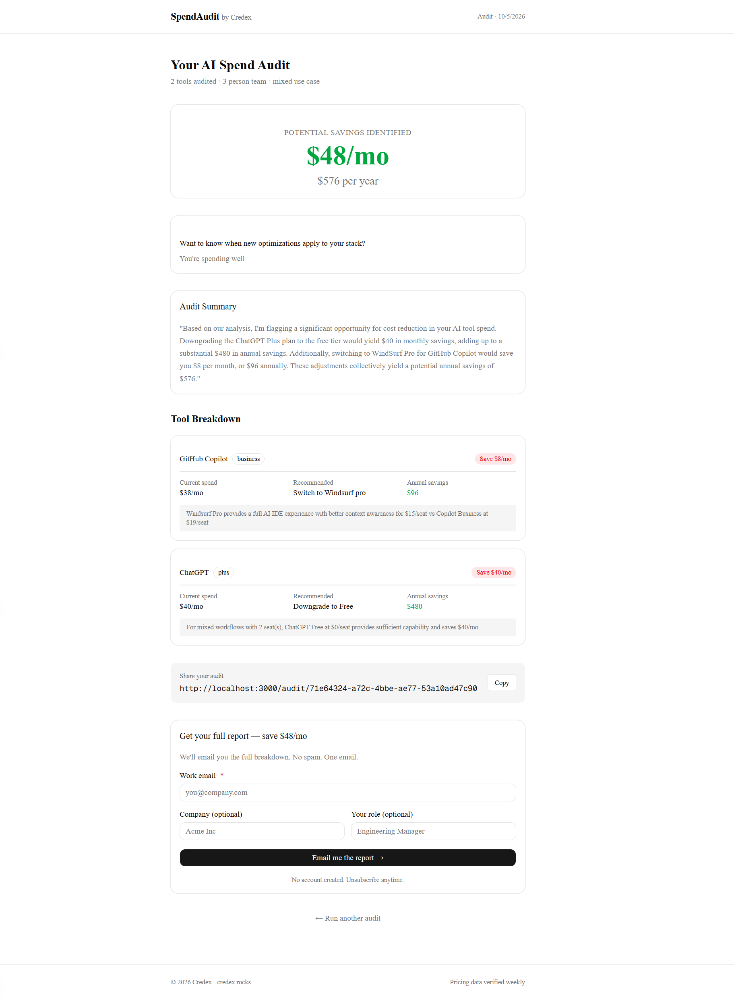
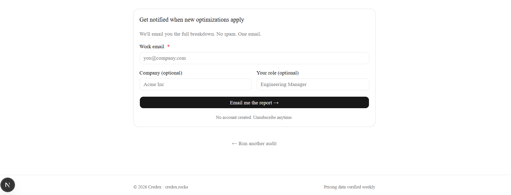

# SpendAudit by Credex

A free web app that audits your AI tool spend and tells you exactly where you're overpaying. Built for startup founders and engineering managers who pay for AI tools but have no benchmark for whether they're spending well.

Built as part of the Credex Web Development Intern Assignment.

---

## Screenshots

1. Landing Page 

2. Results Page

3. Email Capture


---

## Live Demo

🔗 [https://credex-audit-tan.vercel.app/](https://credex-audit-tan.vercel.app/)

---

## Quick Start

### Prerequisites
- Node.js 18+
- npm
- Supabase account
- Groq account (free)
- Resend account (free)

### Install

```bash
git clone https://github.com/Varshad-Potle/credex-audit.git
cd credex-audit
npm install
```

### Environment Variables

Create a `.env.local` file in the project root:

NEXT_PUBLIC_SUPABASE_URL=your_supabase_url
NEXT_PUBLIC_SUPABASE_ANON_KEY=your_supabase_anon_key
GROQ_API_KEY=your_groq_api_key
RESEND_API_KEY=your_resend_api_key
NEXT_PUBLIC_BASE_URL=http://localhost:3000

### Database Setup

Run this SQL in your Supabase SQL Editor:

```sql
create table audits (
  id uuid primary key default gen_random_uuid(),
  form_data jsonb not null,
  recommendations jsonb not null,
  total_monthly_savings numeric not null,
  total_annual_savings numeric not null,
  ai_summary text,
  created_at timestamp with time zone default now()
);

create table leads (
  id uuid primary key default gen_random_uuid(),
  audit_id uuid references audits(id),
  email text not null,
  company_name text,
  role text,
  team_size integer,
  created_at timestamp with time zone default now()
);

alter table audits enable row level security;
alter table leads enable row level security;

create policy "Allow all inserts on audits" on audits for insert with check (true);
create policy "Allow all selects on audits" on audits for select using (true);
create policy "Allow all inserts on leads" on leads for insert with check (true);
```

### Run Locally

```bash
npm run dev
```

Open [http://localhost:3000](http://localhost:3000)

### Run Tests

```bash
npm test
```

### Deploy

Connect the repo to Vercel. Add all environment variables in Vercel project settings. Vercel auto-deploys on every push to main.

---

## Decisions

### 1. Hardcoded audit rules instead of AI
The audit engine uses zero LLM calls. All plan-fit logic is deterministic TypeScript rules. AI is unpredictable for financial math — a hardcoded rule that says "Team plan for under 5 users is overkill" is auditable and defensible. An LLM saying the same thing is not.

### 2. Groq over Anthropic API for the summary
Anthropic API requires paid credits. Groq offers a free tier with llama-3.1-8b-instant that produces acceptable 100-word summaries for this use case. The fallback template ensures the results page never breaks if Groq fails.

### 3. Email gate after results, never before
Showing value before asking for email is non-negotiable for conversion. Users who see their savings number first are far more likely to submit their email. Gating before the audit would tank completion rates.

### 4. Supabase over raw Postgres
Supabase provides both database and REST API without running a separate backend server. For a 7-day build, the time saved on infrastructure setup outweighs any performance concerns at this scale.

### 5. Honeypot over hCaptcha for abuse protection
hCaptcha adds friction for real users. A honeypot hidden field catches the majority of automated bots with zero UX impact. For a lead capture form at this scale, honeypot is the right tradeoff. Rate limiting would be added before scaling.